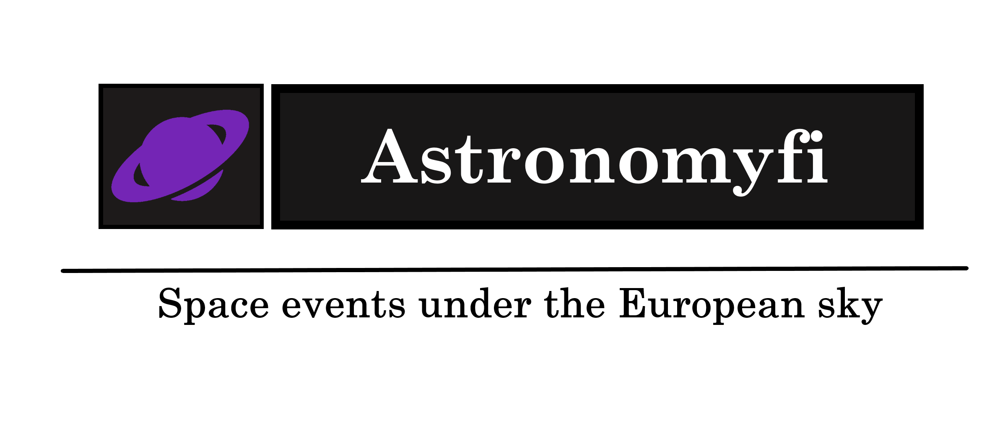

Astronomyfi Website is my defense project for <a href="https://softuni.bg/trainings/3354/asp-dot-net-core-june-2021">ASP.NET Core course</a> at SoftUni (June-August 2021).

###### Overview:

Astronomyfi is a forum system designed specifically for the European region. In it you can find various discussions about astronomy and all things on this topic. You can ask various questions or initiate new conversations on several interesting topics. You also have the opportunity to share photos of the starry sky or space.  
The Forum is mainly focused on events that have occurred or will occur in Europe and the region.(This does not prevent you from having or posting information from all over the world).
  
# 🛠 Built with:
* [.NET Core 5.0](https://github.com/dotnet/core)
* [ASP.NET Core 5.0](https://github.com/dotnet/aspnetcore)
* [Entity Framework Core 5.0](https://github.com/dotnet/efcore)
* [AutoMapper](https://github.com/AutoMapper/AutoMapper)
* [Cloudinary](https://github.com/cloudinary/CloudinaryDotNet)
* [Bootstrap](https://github.com/twbs/bootstrap)

# License

This project is licensed under the MIT License - see the [LICENSE.md](LICENSE) file for details
